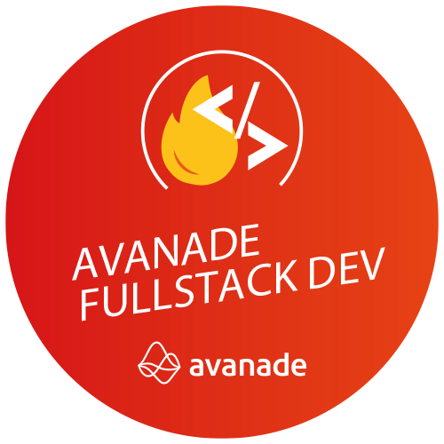

<h1 align="center">DIO</h1>
<p align="center">

</p>


<div align="center">


</div>


------------

<h2>💻  API</h2>
<div align="">

[](https://app.getpostman.com/run-collection/43e13c6346173b7ae77c)
[](https://insomnia.rest/run/?label=api-mongodb-dotnet&uri=https%3A%2F%2Fgithub.com%2FNandosbx%2Fapi-mongodb-dotnet%2Fblob%2Fmaster%2Fapi-mongodb-dotnet.insomnia_collection.json)
</div>


------------

<h2>📖 About</h2>

Project developed in Digital Innovation One's Bootcamp.

------------

<h2>🚀 Technologies</h2>

This project was developed with:
- [.NET Core](https://dotnet.microsoft.com/download ".NET")
- [MongoDB](https://www.mongodb.com/ "MongoDB")


------------


<h2>♻️ How to Contribute</h2>

```
- Fork this repository;

- Make a branch with your feature: `git checkout -b my-feature`

- Commit your changes: `git commit -m 'feat: My new feature'`

- Push your branch: `git push origin my-feature`
```
------------

<h2>🎓 Developed by</h2>

Digital Innovation One 

------------


<h2>📃License</h2>

This project is under MIT License. Access <a href="https://github.com/Nandosbx/api-mongodb-dotnet/blob/master/LICENSE.md">License</a> and learn more.

------------


<footer align="center">
 <strong align="center">Made with 💜 by Fernando Batista</strong>
</footer>
